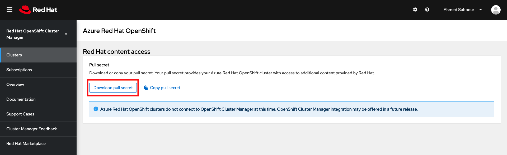
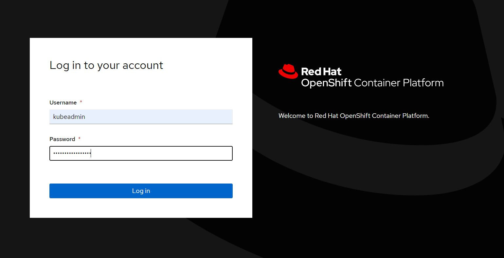
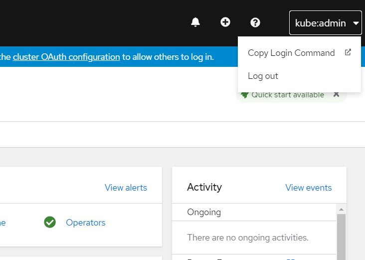

## Creación del Cluster de ARO (Azure RedHat Openshift)

```
#Creamos una VNET
az network vnet create --resource-group RG-ARO --name aro-vnet --address-prefixes 10.0.0.0/22

#Creamos una subnet para los nodos del control plane(master nodes)
az network vnet subnet create --resource-group RG-ARO --vnet-name aro-vnet --name master-subnet --address-prefixes 10.0.0.0/23 --service-endpoints Microsoft.ContainerRegistry

#Creamos una subnet para los nodos workers
az network vnet subnet create --resource-group RG-ARO --vnet-name aro-vnet --name worker-subnet --address-prefixes 10.0.2.0/23 --service-endpoints Microsoft.ContainerRegistry

#Deshabilitamos la politica de link privado para poder acceder a la consola de aro desde la internet
az network vnet subnet update --name master-subnet --resource-group RG-ARO --vnet-name aro-vnet --disable-private-link-service-network-policies true
```

Creamos una cuenta en https://cloud.redhat.com/openshift/install/azure/aro-provisioned damos click a `Download pull secret`, tal como aparece en la imagen



Luego desde la misma carpeta donde bajamos el `pull secret`, abrimos un terminal y ejecutamos en comando de creación del cluster.

```
#Creamos nuestro cluster con la configuración por defecto
az aro create -g RG-ARO -n "ARO-CLUSTER-DEMO" --vnet aro-vnet --master-subnet master-subnet --worker-subnet worker-subnet --worker-count 3 --pull-secret @pull-secret.txt
```

El comando tomará unos 30-40 minutos en desplegar el cluster. Una vez desplegado nos va a mostrar un json, donde nos podemos fijar en la siguiente información:

*`apiserverProfile` contiene la `API URL` necesaria para ingresar al cluster, por medio de `oc`

*`consoleProfile` contiene la `URL` para la consola de aro.

También se pueden obtener si ejecutamos el comando:
```
az aro list -o table
```

El comando construirá un cluster con 3 masters y 3 workers. Los nodos master tendrán un vm-size `D8s_v3` mientras los workers, un vm-size `D4s_v3`desplegados en 3 distintas `Availability Zones` dentro de la región elegida. Estos tamaños de máquinas virtuales y nos número de workers, se pueden modificar, por medio de los parámetros `–master-vm-size` y `–worker-vm-size`.

Para obtener las credenciales de ingreso a la consola, ejecutamos el siguiente comando:
```
az aro list-credentials -n "ARO-CLUSTER-DEMO" --resource-group RG-ARO
```
Luego ingresamos a nuestra consola por medio de algún navegador y nos logueamos con dichas credenciales



## DEMO S2I en Azure RedHat Openshift

S2I es un framework de Openshift, el que utiliza como entrada un contenedor, scripts y el código fuente de tu aplicación y genera como resultado un contenedor listo para ejecutar tu aplicación. Lo que el desarrollador tiene que hacer es escribir los scripts en los que indicará cómo construir el artefacto a partir de su código fuente y cómo ejecutar dicho artefacto.

En la mayoría de casos ni eso, ya que existen scripts estándar para varios lenguajes y arquitecturas. Estos scripts se ejecutarán dentro de un contenedor llamado `builder` que se encargará de construir el contenedor que ejecuta tu aplicación.

Actualmente existen `builders` para diferentes lenguajes y plataformas como `php`, `nodeJS`, `wildfly`, `ruby`, `python` y `perl`, además de la posibilidad de construir tu propio ‘builder’, lo cual es bastante sencillo de realizar.


Luego vamos a dar un tour sobre la consola de `openshift`. Van a ver que se puede administrar gran parte de nuestro cluster, directamente desde la consola.

Ahora vamos a usar `S2I` para que lea nuestro repositorio, detecte el lenguaje de programación, y nos cree automáticamente una imagen de contenedor, y que además se va a encargar de desplegar esa imagen a nuestro cluster. Todo esto sin `Dockerfiles` ni archivos `YAML`. Solamente con el código fuente y ya está 🤓

Vamos o obtener el comando de conexión para el cliente `oc` desde la consola, dando click en `Copy Login Command`


Nos logueamos desde nuestro terminal usando el comando del paso anterior, muy similar a:
```
oc login --token=sha256~eltoken --server=https://api.elserver.eastus2.aroapp.io:6443
```

Ahora vamos a crear un projecto, con un nombre que nos guste, como `demo`
```
oc new-project demo
```

Luego vamos a usar `S2I` para que lea nuestro repositorio y despliegue la aplicación automáticamente en ARO
```
oc new-app https://github.com/AshWilliams/PHPUploadDemoARO --strategy=source
```

Verificamos con el comando
```
oc get all
```

Luego exponemos el servicio con el siguiente comando
```
oc expose svc/phpuploaddemoaro
```

Obtenemos la url de nuestra aplicación, con la instrucción:
```
oc get routes
```

Luego navegamos a nuestra url y vemos funcionando nuestro sitio 🦾🤓


Para eliminar lo creado, usamos la instrucción:
```
oc delete project <project_name>
```


